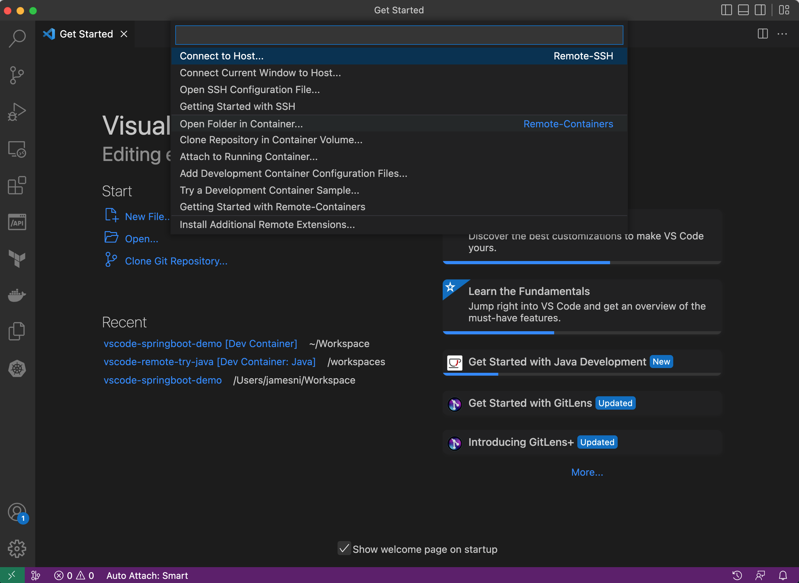
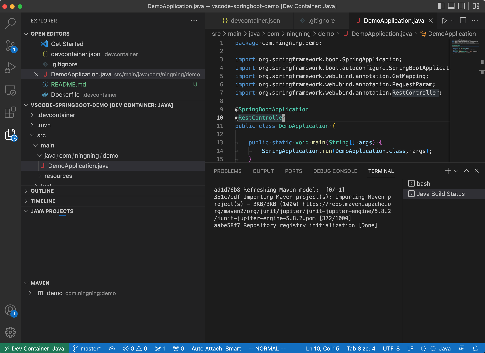
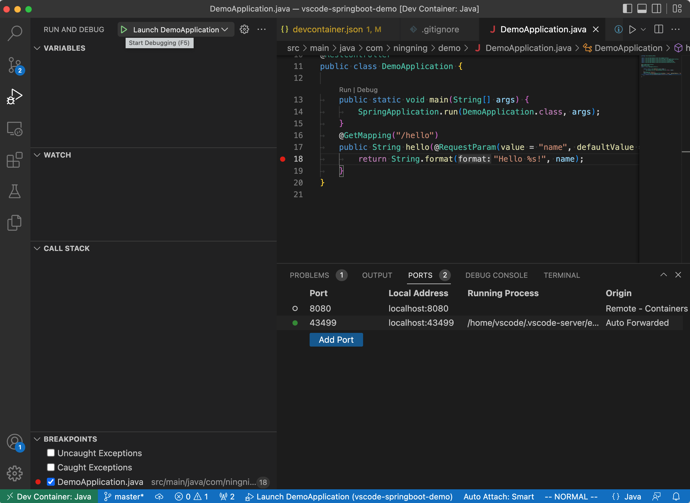
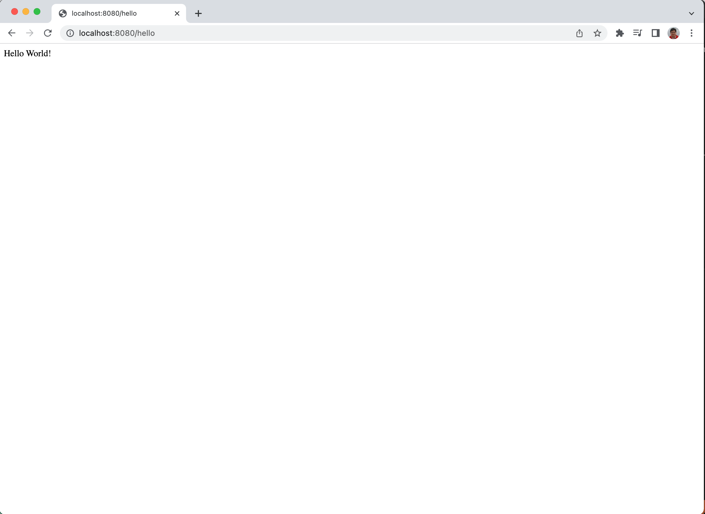

A demo project which shows how to develop a Spring Boot application using VS Code dev container.

## Get Started

### Prerequisite

1. Install Docker Desktop

1. Install VS Code

### Run this app

1. Clone this repo
    ```bash
    git clone xxx
    ```

1. Open VS Code, click the "green" button at bottom left, select "Open Folder in Container"

    

1. It may take a while to build the docker image, install extensions, download dependencies and compile the Spring Boot app

    

1. Once the build is done, you can run the application by press `F5`

    

1. The app should be up and running at http://localhost:8080

    